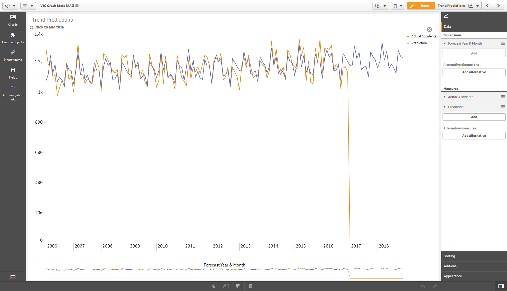
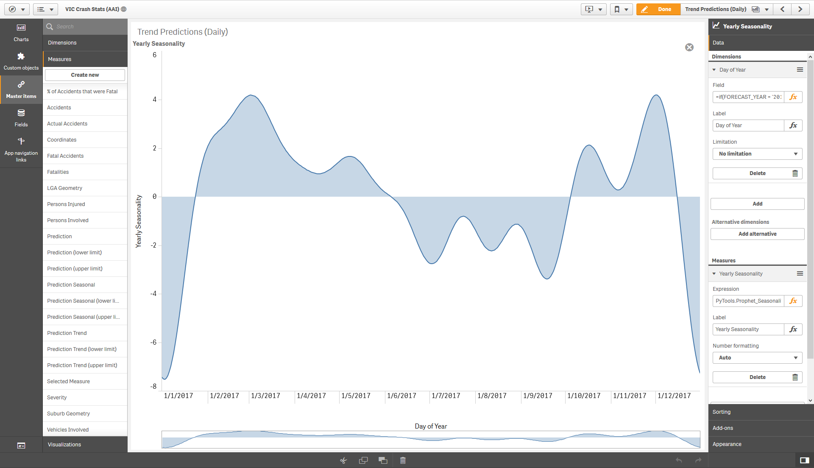
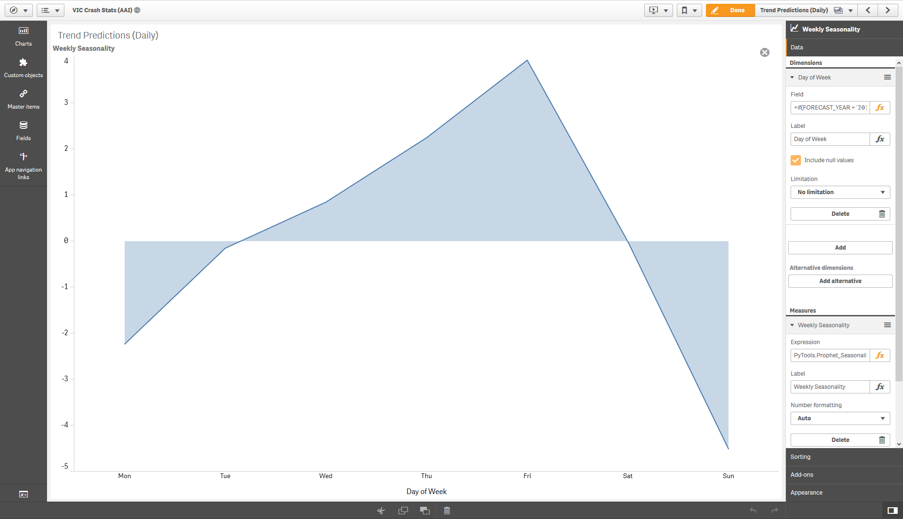
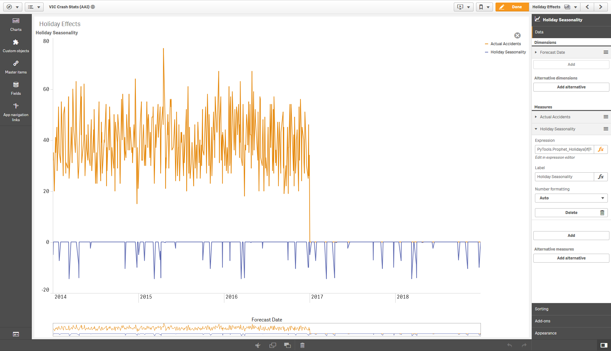
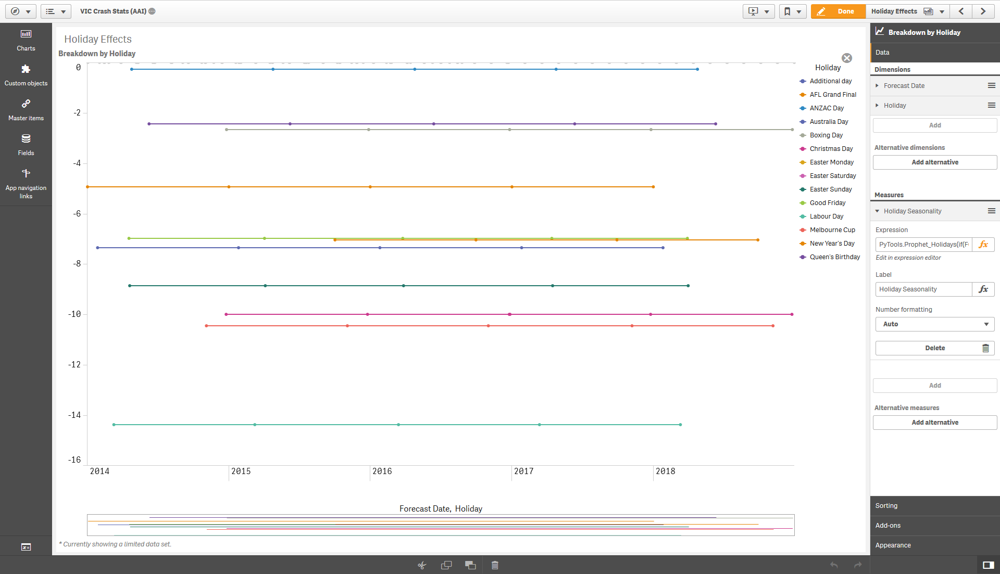
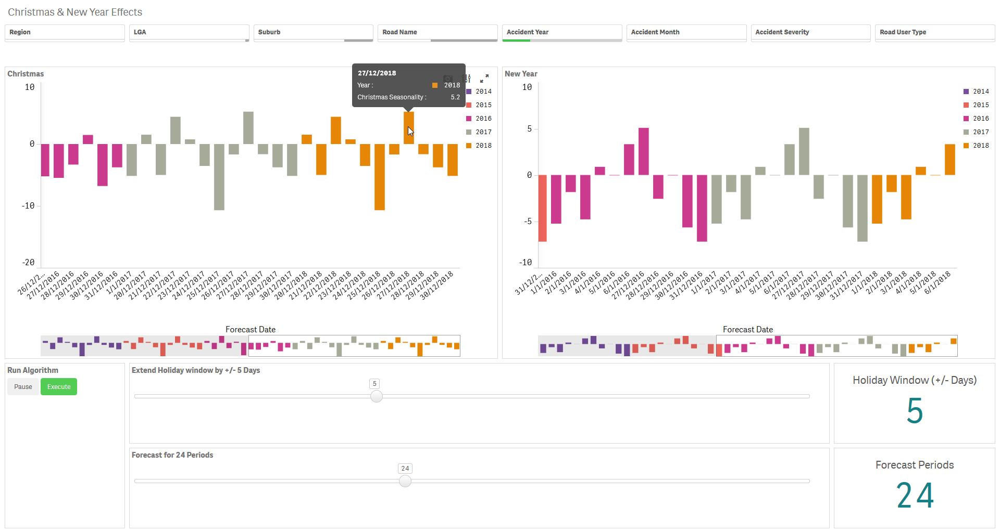
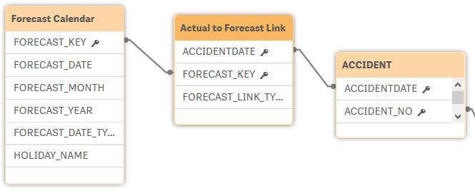

# Time series forecasting with Facebook Prophet

## Table of Contents

- [Introduction](#introduction)
- [Quick Start](#quick-start)
- [Additional Parameters](#additional-parameters)
- [Tweaking the forecast](#tweaking-the-forecast)
- [Seasonality](#seasonality)
- [Holidays](#holidays)
- [Use Prophet with your own app](#use-prophet-with-your-own-app)
- [Precalculating forecasts in the load script](#precalculating-forecasts-in-the-load-script)
- [Attribution](#attribution)

## Introduction

Last year Facebook's data science team released an open source forecasting tool for Python and R. There is no shortage of forecasting algorithms out there, but this one is impressive in how effortlessly it produces high quality forecasts. I recommend a quick read of [Facebook's post](https://research.fb.com/prophet-forecasting-at-scale/).

While this is a great tool, there is a scarcity of people with the skills to use such tools at most organizations. Qlik's advanced analytics integration can bridge this gap by providing a simple, interactive experience for generating quality forecasts.

The Prophet functions in this SSE provides almost all of Prophet's capabilities in Qlik through simple expressions.

## Quick Start

You use the Prophet functions in Qlik with the syntax:

`<Analytic connection name>.Prophet([Date Column], [Value Column], 'arg1=value1, arg2=value2, ...')`

The `[Date Column]` must extend into the future to cover the periods you want to forecast. The `[Value Column]` should simply send `NULL` values for these future periods.

There are a few variants of the Prophet function made available, but this is the main function and we'll look at the other ones later.

Here's an example of an actual expression:

`PyTools.Prophet(FORECAST_MONTH, Count({$<FORECAST_LINK_TYPE = {'Actual'}>} Distinct ACCIDENT_NO), 'freq=MS, return=yhat')`

In this example the first column is the forecast month, the second column is the measure we want to forecast and the third column is a string of additional key word arguments. 

Using this expression in a line chart, with the dimension as forecast month, and another measure to show the actual values, gives us this result:



As you can see, without any tweaking, we have a pretty accurate forecast.

## Additional Parameters

The additional arguments provided through the last parameter let you use the different features of Prophet.

Any of these arguments can be included in the final string parameter for the Prophet function using the syntax: `argument=value`. Separate arguments with a comma and use single quotes around the entire string.

| Keyword | Description | Sample Values | Remarks |
| --- | --- | --- | --- |
| return | The output of the expression | `yhat`, `yhat_upper`, `yhat_lower`, `y_then_yhat`, `y_then_yhat_upper`, `y_then_yhat_lower`, `trend`, `trend_upper`, `trend_lower`, `seasonal`, `seasonal_upper`, `seasonal_lower`, `yearly`, `yearly_upper`, `yearly_lower` & any other column in the forecast output | `yhat` refers to the forecast values. This is the default value. The `y_then_yhat` options allow you to plot the actual values for historical data and forecast values only for future dates. Upper and lower limits are available for each type of output. |
| freq | The frequency of the time series | `D`, `MS`, `M`, `H`, `T`, `S`, `ms`, `us` | The most common options would be D for Daily, MS for Month Start and M for Month End. The default value is D, however this will mess up results if you provide the values in a different frequency, so always specify the frequency. See the full set of options [here](http://pandas.pydata.org/pandas-docs/stable/user_guide/timeseries.html#offset-aliases). |
| debug | Flag to output additional information to the terminal and logs | `true`, `false` | Information will be printed to the terminal as well to a log file: `..\qlik-py-env\core\logs\Prophet Log <n>.txt`. Particularly useful is looking at the Request Data Frame to see what you are sending to the algorithm and the Forecast Data Frame to see the possible result columns. |
| load_script | Flag for calling the function from the Qlik load script. | `true`, `false` | Set to `true` if calling the Prophet function from the load script in the Qlik app. This will change the output to a table consisting of two fields; `ds` which is the datetime dimension passed to Prophet, and the specified return value (`yhat` by default). `ds` is returned as a string in the format `YYYY-MM-DD hh:mm:ss TT`.<br/><br/>This parameter only applies to the `Prophet` function. |
| take_log | Take a logarithm of the values before forecasting | `true`, `false` | Default value is `false`. This can be applied when making the time series more stationary might improve forecast values. You can just try both options and compare the results. In either case the values are returned in the original scale. |
| random_seed | An integer to control some of the stochasticity in the model | An integer value e.g. `42`, `1000` | The random seed can be used to make uncertaintly intervals for predictions deterministic and repeatable. If using `mmc_samples` > 0 this also applies to MMC sampling. However there may still be small variances in results from the model. More info [here](https://github.com/facebook/prophet/issues/849). |
| cap | A saturating maximum for the forecast | A decimal or integer value e.g. `1000000` | You can apply a logistic growth trend model using this argument. For example when the maximum market size is known. More information [here](https://facebook.github.io/prophet/docs/saturating_forecasts.html). |
| floor | A saturating minimum for the forecast | A decimal or integer value e.g. `0` | This argument must be used in combination with a cap. |
| changepoint_prior_scale | A parameter to adjust the trend flexibility | A decimal value e.g. `0.05` | If the trend changes are being overfit (too much flexibility) or underfit (not enough flexibility), you can try adjusting this parameter. The default value is `0.05`. Increasing it will make the trend more flexible. Decreasing it will make the trend less flexible. More information [here](https://facebook.github.io/prophet/docs/trend_changepoints.html). |
| n_changepoints | Number of potential changepoints to include | An integer value e.g. `50` |  This number of potential changepoints are selected uniformly from the first `changepoint_range` proportion of the history. The default value is `25`. |
| changepoint_range | Proportion of history in which trend changepoints will be estimated | A decimal value less than 1 e.g. `0.9` |  Defaults to `0.8` for the first 80%. |
| interval_width | The width of the uncertainty intervals | A decimal value e.g. `0.8` | The default value is `0.8` (80%). More information [here](https://facebook.github.io/prophet/docs/uncertainty_intervals.html). |
| uncertainty_samples | Number of simulated draws used to estimate uncertainty intervals | An integer value e.g. `1000` | The default value is `1000`. |
| mcmc_samples | Set the number of MCMC samples | An integer value e.g. `1000` | If greater than 0, Prophet will do full Bayesian inference with the specified number of MCMC samples. If 0, Prophet will do MAP estimation. The default value is `0`. |
| seasonality_mode | Use additive or multiplicative model for seasonality. | `additive`, `multiplicative` | By default Prophet fits additive seasonalities, meaning the effect of the seasonality is added to the trend to get the forecast. If the seasonality is not a constant additive factor as assumed by Prophet, rather it grows with the trend you can set this parameter to `multiplicative`. More information [here](https://facebook.github.io/prophet/docs/multiplicative_seasonality.html). |
| add_seasonality | Additional seasonality to be considered in the forecast. | A string value which represents the name of the seasonality e.g. `monthly` | Prophet will by default fit weekly and yearly seasonalities, if the time series is more than two cycles long. It will also fit daily seasonality for a sub-daily time series. You can add other seasonalities (monthly, quarterly, hourly) using this parameter. More information [here](https://facebook.github.io/prophet/docs/seasonality_and_holiday_effects.html). |
| add_seasonality_mode | Use additive or multiplicative model for the additional seasonality. | `additive`, `multiplicative` | See the `seasonality_mode` parameter above. If the additional seasonality requires a different mode you can use this parameter. More information [here](https://facebook.github.io/prophet/docs/multiplicative_seasonality.html). |
| seasonality_period | Period for the additional seasonality | A decimal or integer value e.g. `30.5` | This is the period of the seasonality in days. |
| seasonality_fourier | Fourier terms for the additional seasonality | An integer value e.g. `5` | For reference, by default Prophet uses 3 terms for weekly seasonality and 10 for yearly seasonality. Increasing the number of Fourier terms allows the seasonality to fit faster changing cycles, but can also lead to overfitting. |
| seasonality_prior_scale | The extent to which the seasonality model will fit the data | A decimal or integer value e.g. `0.05` | If you find that the seasonalities are overfitting, you can adjust the prior scale to smooth them using this parameter. |
| holidays_prior_scale | The magnitude of the holiday effect, if holidays are included in the function | A decimal or integer value e.g. `10` | If you find that the holidays are overfitting, you can adjust their prior scale to smooth them using this parameter. By default this parameter is `10`, which provides very little regularization. Reducing this parameter dampens holiday effects. |
| weekly_start | Set the start of the week when calculating weekly seasonality | An integer value e.g. `6` (for Monday) | Only relevant when the using the Prophet_Seasonality function to get the weekly seasonality. See more below in the Seasonality section. `0` represents Sunday, `6` represents Monday. |
| yearly_start | Set the start of the year when calculating yearly seasonality | An integer value e.g. `0` (for 1st Jan) | Only relevant when the using the Prophet_Seasonality function to get the yearly seasonality. See more below in the Seasonality section. `0` represents 1st Jan, `1` represents 2nd Jan and so on. |
| lower_window | Extend the holidays by certain no. of days prior to the date. | A negative integer value e.g. `-1` | Only relevant when passing holidays to Prophet. This can be used to analyze holiday effects before a holiday e.g. 7 days before Christmas. |
| upper_window | Extend the holidays by certain no. of days after the date. | A positive integer value e.g. `1` | Only relevant when passing holidays to Prophet. This can be used to analyze holiday effects after a holiday e.g. 1 day after New Year. |

## Tweaking the forecast

Prophet is meant to require little or no tweaking. Just make sure you provide the correct frequency in the arguments. If the forecast is overfitting (too much flexibility) or underfitting (not enough flexibility), you can adjust the `changepoint_prior_scale` argument described above.

Other ways to adjust forecasts may be to use the `take_log` argument or to apply custom seasonality (see key word arguments above) or holidays (described below). You may also get better results by simply considering your selections in Qlik on the actual and forecasting periods.

## Seasonality

Prophet will by default fit weekly and yearly seasonalities, if the time series is more than two cycles long. It will also fit daily seasonality for a sub-daily time series. You can add other seasonalities (monthly, quarterly, hourly) using the add_seasonality argument described above.

The seasonalities are available in the forecast and can be plotted against the original time series by specifying the correct return type e.g. return=yearly. However, you might want to plot the seasonality against a more relevant scale. For this you can use the `Prophet_Seasonality` function.

This has somewhat different requirements:

`<Analytic connection name>.Prophet_Seasonality([Seasonality Column], 'Concatenated TimeSeries as String', 'Concatentated Holidays as String', 'arg1=value1, arg2=value2, ...')`

Here's an actual example for plotting yearly seasonality by day of year rather than over multiple years. The year itself (2017 in this case) is arbitrary as the seasonality effects are the same for every year.

`PyTools.Prophet_Seasonality(Max({$<FORECAST_YEAR = {'2017'}>} FORECAST_DATE), $(vAccidentsByDate), '', 'freq=D, seasonality=yearly, return=yearly')`

The time series is provided by a variable that concatenates all the data into a string. This is a workaround as AAI integration for charts requires the number of output rows to equal the number of input rows.

Here we don't provide holidays so an empty string is used as the third argument.

Note that the dates must be provided in their numerical representation by using the `Num()` function in Qlik.

`Concat(DISTINCT TOTAL Aggr(Num(FORECAST_DATE) & ':' & Count({$<FORECAST_LINK_TYPE = {'Actual'}>} Distinct ACCIDENT_NO), FORECAST_DATE), ';')`

With this we can get a nice seasonality plot by day of year. Similarly we can plot other seasonalities with different scales.




## Holidays

You can add holidays to the model by using the `Prophet_Holiday` function. This variant takes an additional parameter which should give the holiday name, if any, for each date in the time series. You need to provide holidays for future dates as well. If you don't have holiday dates for all of your time series, just apply some selections before analyzing the holiday effects.

`<Analytic connection name>.Prophet_Holiday([Date Column], [Value Column], [Holiday Name Column], 'arg1=value1, arg2=value2, ...')`

Here's an example of an actual expression. The `HOLIDAY_NAME` will be `NULL` or the name of the holiday for each date in the `FORECAST_DATE` column.

`PyTools.Prophet_Holidays(FORECAST_DATE, Count({$<FORECAST_LINK_TYPE = {'Actual'}>} Distinct ACCIDENT_NO), HOLIDAY_NAME, 'freq=D, return=holidays')`

This lets us plot the holiday effects against the original time series.



Individual holiday effects can be seen by specifying the holiday name in the return argument. But note that the holiday names are changed to lower case, spaces are replaced with underscores and apostrophes are removed. Remember you can see the forecast return options by using debug=true.

You could also put the holiday names as a second dimension in your chart to see the breakdown of effect by each holiday. This is not a general rule and using a second dimension will usually mess up the results. This works for holidays as they have the same granularity as the forecast dates.



You can analyze holiday effects around the date by specifying the `lower_window` and `upper_window` parameters. These can extend the holiday effect to before and after a holiday respectively.



The `Prophet_Seasonality` function also allows you to add holidays to the forecast. The holidays need to be provided as a concatenated string made up of the numerical value of the date followed by the holiday names. Use a colon between the date and holiday name and a semicolon between different dates. For example:

`Concat({$<HOLIDAY_NAME={*}>} Distinct Total Num(FORECAST_DATE) & ':' & HOLIDAY_NAME, ';')`

## Use Prophet with your own app

You should have completed the installation instructions in the master README.md.

The [sample app](Sample_App_Prophet.qvf) can be used as a template for the instructions below.

Firstly, you should set up your Qlik data model with a forecasting calendar. These instructions work with daily and monthly forecasts, but should teach you enough to build a sub daily forecast as well. 

_Note that it is not necessary to build a forecast calendar as explained below. We simply need to include the periods to be forecasted in the input dataset. You can create these periods in the data source and simply leave them empty. However, building a forecast calendar as explained below lets the user control the number of periods they want to forecast, and make selections and exclusions for any dimension without introducing gaps in the forecast._



In your load script add a section for the Forecast Calendar and copy the script below. You'll need to replace `ACCIDENTDATE` with your key date field, and replace the `ACCIDENT` table with the relevant table in your data model.

```
// Here we set the maximum number of years to be forecasted
SET vMaxForecastYears = 5;
 
// We then get the minimum and maximum dates in the key date field
[TempDateMinMax]:
LOAD
    min([ACCIDENTDATE]) as minDate,
    max([ACCIDENTDATE]) as maxDate
RESIDENT [ACCIDENT];
 
// We store the minimum date as a variable. This will be the start date for our forecast calendar
LET vCalendarStartDate = Peek('minDate', 0, 'TempDateMinMax');
// We also store the start date for the forecasting (the first 'future' date). No historical data exists from this date onwards
LET vForecastStartDate = Peek('maxDate', 0, 'TempDateMinMax')+1;
// Finally store the the last date for the forecast
LET vForecastEndDate = $(vForecastStartDate) + 365 * $(vMaxForecastYears);
 
// Now that we have the variables the temp table can be dropped
drop table TempDateMinMax;
 
// Create a calendar from the earliest date in the data to the maximum forecast date
// Read from the third load statement below to the top as this is a preceding load
[Forecast Calendar]:
LOAD
    FORECAST_DATE,
    FORECAST_WEEK,
    FORECAST_MONTH,
    FORECAST_YEAR,
    FORECAST_DATE_TYPE,
    '<ALL>' as FORECAST_KEY;
 
// Create month and year fields as well as a field to tell us if the date is historic or in the future:
LOAD
    FORECAST_DATE,
    Dual(Year([FORECAST_DATE]) & '-' & Week([FORECAST_DATE]), WeekStart([FORECAST_DATE])) as FORECAST_WEEK,
    Dual(Year([FORECAST_DATE]) & '-' & Month([FORECAST_DATE]), MonthStart([FORECAST_DATE])) as FORECAST_MONTH,
    Year([FORECAST_DATE]) as FORECAST_YEAR,
    if(FORECAST_DATE < $(vForecastStartDate), 'Historic', 'Future') as FORECAST_DATE_TYPE;
 
// Autogenerate dates for the required range:
LOAD 
      Date($(vCalendarStartDate) + IterNo() - 1) as FORECAST_DATE 
AutoGenerate 1
While $(vCalendarStartDate) + IterNo() - 1 <= $(vForecastEndDate);
 
// Notice the <ALL> in the load above. In our first run we create a generic key that will link each date in the forecast calendar to all actual dates.
// In the load below, we create a copy of the data in the Forecast Calendar where the key is the actual Date
// This will help us separate selections on actual dates/ months/ years with forecast dates and avoid gaps in our forecasting.
Concatenate([Forecast Calendar])
LOAD
    FORECAST_DATE,
    FORECAST_WEEK,
    FORECAST_MONTH,
    FORECAST_YEAR,
    FORECAST_DATE_TYPE,
    FORECAST_DATE as FORECAST_KEY
RESIDENT [Forecast Calendar];
 
// Optional bit if you want to consider specific holidays in the forecast.
// Here we add holidays to the Forecast Calendar. In this case we only have holidays from 2014-2019 so we should only use holiday functions for this range.
// With a left join we get NULL values in HOLIDAY_NAME if there was no holiday on that date. This is what we want.
//LEFT JOIN ([Forecast Calendar])
//LOAD
//    Date(Date#("Date", 'YYYYMMDD')) as FORECAST_DATE,
//    "Holiday Name" as HOLIDAY_NAME
//FROM [lib://Data/Misc\VIC Public Holidays\australianpublicholidays-2014-2019.xlsx]
//(ooxml, embedded labels, table is australianpublicholidays)
//WHERE "Applicable To" = 'NAT' OR Index("Applicable To", 'VIC') > 0;
 
// Add a separate column for each holiday in case we want to analyze it separately
//FOR Each hol in FieldValueList('HOLIDAY_NAME')
//    IF Len('$(hol)') > 0 THEN
//        LEFT JOIN ([Forecast Calendar])
//        LOAD
//            FORECAST_DATE,
//            HOLIDAY_NAME as '$(hol)'
//        RESIDENT [Forecast Calendar]
//        WHERE HOLIDAY_NAME = '$(hol)';
//    END IF
//NEXT hol
 
// The values to be forecasted are linked to the forecast calendar by the key date
[Actual to Forecast Link]:
LOAD DISTINCT
    ACCIDENTDATE,
    'Actual' as FORECAST_LINK_TYPE,
    ACCIDENTDATE as FORECAST_KEY
RESIDENT ACCIDENT;
 
// Each key date is also linked to all possible dates in the forecast calendar
// This is to allow the timeseries to be plotted without any gaps
Concatenate([Actual to Forecast Link])
LOAD DISTINCT
    ACCIDENTDATE,
    'Generic' as FORECAST_LINK_TYPE,
    '<ALL>' as FORECAST_KEY
RESIDENT ACCIDENT;
```

Do a reload so that these changes are added to your data model. Note that based on these associations you will need to use set analysis restricting the `FORECAST_LINK_TYPE` to `Actual` when using a measure with dimensions from the Forecast Calendar table.

```
Count({$<FORECAST_LINK_TYPE = {'Actual'}>} Distinct ACCIDENT_NO)
```

Next we create a few variables that will help us in setting up a good user experience:

```
vForecastPeriods
// The number of periods to forecast. This variable is controlled by the qsVariable extension slider at the bottom of each sheet.
24
 
vPausePredictions
// This variable is used to pause or play the forecasting algorithm. It can be toggled with the qsVariable buttons at the bottom of each sheet.
// Useful when you need to make a bunch of selections and run the forecast at the end
pause
 
vHolidayWindow
// This will be used when analyzing holiday effects. This variable can be adjusted to consider days around the holidays
5
```

In the same app you'll notice there are calculation conditions placed on all of the forecasting visualizations. This is a good practice as the user might want to make a series of selections and you can let them put forecasting on hold until they are ready. You can just copy the buttons, slider and KPI object to your app if you like.

Now we can create our dimensions and measures.

The dimensions used in the Prophet visualizations are restricted to the number of forecast periods controlled by the slider at the bottom. Hence we use calculated dimensions:

```
Forecast Year & Month
// Dimension for the Forecast Months based on the chosen number of periods
if(FORECAST_MONTH <= AddMonths(Max(Total [Accident Month & Year]), $(vForecastPeriods)), FORECAST_MONTH)
 
Forecast Date
// Dimension for the Forecast Dates based on the chosen number of periods
if(FORECAST_MONTH <= AddMonths(Max(Total [Accident Month & Year]), $(vForecastPeriods)), FORECAST_DATE)
```

For the visualizations that use these dimensions we use the `Prophet` function in the measures like this:

```
Prediction
// The forecast results by month & year. Frequency is set to Month Start.
PyTools.Prophet(if(FORECAST_MONTH <= AddMonths(Max(Total [Accident Month & Year]), $(vForecastPeriods)), FORECAST_MONTH),
                Count({$<FORECAST_LINK_TYPE = {'Actual'}>} Distinct ACCIDENT_NO),
                'freq=MS, return=yhat')
 
Prediction (lower limit)
// The lower limit of the monthly forecast. The uncertainty could be controlled by the interval_width argument.
PyTools.Prophet(if(FORECAST_MONTH <= AddMonths(Max(Total [Accident Month & Year]), $(vForecastPeriods)), FORECAST_MONTH),
                Count({$<FORECAST_LINK_TYPE = {'Actual'}>} Distinct ACCIDENT_NO),
                'freq=MS, return=yhat_lower')
 
Prediction (upper limit)
// The upper limit of the monthly forecast.
PyTools.Prophet(if(FORECAST_MONTH <= AddMonths(Max(Total [Accident Month & Year]), $(vForecastPeriods)), FORECAST_MONTH),
                Count({$<FORECAST_LINK_TYPE = {'Actual'}>} Distinct ACCIDENT_NO),
                'freq=MS, return=yhat_upper')
 
Prediction Seasonal
// The seasonal component of the monthly forecast. You could use season_upper or seasonal_lower to get the uncertainty intervals.
PyTools.Prophet(if(FORECAST_MONTH <= AddMonths(Max(Total [Accident Month & Year]), $(vForecastPeriods)), FORECAST_MONTH),
                Count({$<FORECAST_LINK_TYPE = {'Actual'}>} Distinct ACCIDENT_NO),
                'freq=MS, return=seasonal')
 
Prediction Trend
// The trend component of the monthly forecast. You could use trend_upper or trend_lower to get the uncertainty intervals.
PyTools.Prophet(if(FORECAST_MONTH <= AddMonths(Max(Total [Accident Month & Year]), $(vForecastPeriods)), FORECAST_MONTH),
                Count({$<FORECAST_LINK_TYPE = {'Actual'}>} Distinct ACCIDENT_NO),
                'freq=MS, return=trend')
 
Prediction (Daily)
// The forecast results by date. This measure will need more processing time.
// Compare this to the first measure above. Dimension is changed to the dates and frequency is set to Daily.
PyTools.Prophet(if(FORECAST_MONTH <= AddMonths(Max(Total [Accident Month & Year]), $(vForecastPeriods)), FORECAST_DATE),
                Count({$<FORECAST_LINK_TYPE = {'Actual'}>} Distinct ACCIDENT_NO),
                'freq=D, return=yhat')
 
Prediction (Daily Trend)
// The trend for our daily forecast.
PyTools.Prophet(if(FORECAST_MONTH <= AddMonths(Max(Total [Accident Month & Year]), $(vForecastPeriods)), FORECAST_DATE),
                Count({$<FORECAST_LINK_TYPE = {'Actual'}>} Distinct ACCIDENT_NO),
                'freq=D, return=trend')
```

The `vPausePredictions` variable can also be used inside the forecast measure to conditionally display the forecast:

```
PyTools.Prophet(if(FORECAST_MONTH <= AddMonths(Max(Total [Accident Month & Year]), $(vForecastPeriods)), FORECAST_MONTH),
                if('$(vPausePredictions)' <> 'pause', Count({$<FORECAST_LINK_TYPE = {'Actual'}>} Distinct ACCIDENT_NO),
                'freq=MS, return=yhat')
```

For analyzing seasonality we need to set up additional variables which will be used in our `Prophet_Seasonality` expressions:

```
vAccidentsByMonth
// Accidents by month as a concatenated string. Months must be presented as numeric values based on the month start date.
Concat(DISTINCT TOTAL Aggr(Num(FORECAST_MONTH) & ':' & Count({$<FORECAST_LINK_TYPE = {'Actual'}>} Distinct ACCIDENT_NO), FORECAST_MONTH), ';')
 
vAccidentsByDate
// Accidents by date as a concatenated string. Dates must be presented as numeric values.
Concat(DISTINCT TOTAL Aggr(Num(FORECAST_DATE) & ':' & Count({$<FORECAST_LINK_TYPE = {'Actual'}>} Distinct ACCIDENT_NO), FORECAST_DATE), ';')
 
vHolidays
// Public holidays as a concatenated string. Dates must be presented as numeric values.
Concat({$<HOLIDAY_NAME={*}>} Distinct Total Num(FORECAST_DATE) & ':' & HOLIDAY_NAME, ';')
```

For the seasonality visualizations we use special dimensions and the `Prophet_Seasonality` function. This is so we can plot the seasonalities against an intuitive scale.

```
Day of Year
// This dimension is used when plotting the yearly seasonality
// Use any full year of data for generating the Day of Year
if(FORECAST_YEAR = '2017', FORECAST_DATE)
 
Day of Week
// This dimension is used when plotting the weekly seasonality
if(FORECAST_YEAR = '2017', Weekday(FORECAST_DATE))

Yearly Seasonality
// Yearly seasonality best works for the daily frequency.
// Note that we have to use the Prophet_Seasonality function. The vAccidentsByDate variable provides the time series, while an empty string is passed for holidays in this case.
PyTools.Prophet_Seasonality(Max({$<FORECAST_YEAR = {'2017'}>} FORECAST_DATE), $(vAccidentsByDate), '', 'freq=D, seasonality=yearly, return=yearly')
 
Weekly Seasonality
// Weekly seasonality is only available with the daily frequency in this data model.
// We use the weekly_start parameter to tell Prophet to start the week from Monday
PyTools.Prophet_Seasonality(Max({$<FORECAST_YEAR = {'2017'}>} FORECAST_DATE), $(vAccidentsByDate), '', 'freq=D, return=weekly, seasonality=weekly, weekly_start=6') 
```

Finally for the Holiday Effects visualizations we use the date dimensions and `Prophet_Holiday` functions. We pass the `HOLIDAY_NAME` field as the third argument and the additional parameters become the fourth argument.

For showing a breakdown by holiday we can simply add the holiday field as a second dimension in our line chart. This is not a general rule and second dimensions will usually fail, but in this case we have modeled the data for this to work.

```
Holiday Seasonality
// Note that we have to use the Prophet_Holidays function when specifying a holiday column in the arguments
PyTools.Prophet_Holidays(if(FORECAST_MONTH <= AddMonths(Max(Total [Accident Month & Year]), $(vForecastPeriods)), FORECAST_DATE),
                Count({$<FORECAST_LINK_TYPE = {'Actual'}>} Distinct ACCIDENT_NO),
                HOLIDAY_NAME,
                'freq=D, return=holidays')
```

Since we created a separate column for each holiday in the data model, we can also pass in a specific holiday easily.

```
Christmas Seasonality
// The vHolidayWindow variable allows the lower and upper windows to be dynamic
PyTools.Prophet_Holidays(if(FORECAST_MONTH <= AddMonths(Max(Total [Accident Month & Year]), $(vForecastPeriods)), FORECAST_DATE),
                Count({$<FORECAST_LINK_TYPE = {'Actual'}>} Distinct ACCIDENT_NO),
                [Christmas Day],
                'freq=D, return=holidays, lower_window=-$(vHolidayWindow), upper_window=$(vHolidayWindow)')
```

## Precalculating forecasts in the load script

The approach explained above provides the forecast in the context of the user's selections in Qlik. This is a powerful user experience and does not require the app author to think of the granularity at which the forecast needs to be generated.

However, in some cases, you may want to precalculate the forecast for a given set of dimensions, e.g. by product and region. This can be done through the Qlik load script. 

For an example, refer to the [simple sample app](Sample_App_Forecasting_Simple.qvf)

```
// Generate forecasts for each value in the Hospital field
FOR EACH vHospital in FieldValueList('Hospital')

    // Load the actual data and arguments to be passed to the Prophet function
    // Future periods must be included in the date dimension with NULL values for the measure
    temp:
    LOAD
    	[Month Start] as ds,
        Attendances as y,
        'freq=M, take_log=true, load_script=true' as args
    RESIDENT Sheet1
    WHERE Hospital = '$(vHospital)';
    
    // Call the Prophet function and store the results in the Response table
    Response:
    LOAD
    	ds, // Datetime is returned as string with format 'YYYY-MM-DD hh:mm:ss TT'
        yhat,
    	'$(vHospital)' as Hospital
    Extension PyTools.Prophet(temp{ds, y, args});
    
    Drop table temp;
	
Next vHospital

// Add a composite key to the original table. This will be used to link to the forecasts.
Left Join (Sheet1)
Load
    Hospital,
    [Month Start],
    Period,
    AutoNumber(Hospital & '|' & Period) as ForecastKey
Resident Sheet1;

// Create a Forecasts table with the same composite key.
Forecasts:
Load
    AutoNumber(Hospital & '|' & Period) as ForecastKey,
    [Forecast by Hospital];
Load
    Hospital,
    Floor(Date#(ds, 'YYYY-MM-DD hh:mm:ss TT')) as Period,
    yhat as [Forecast by Hospital]
Resident Response;

// Drop the Response table from the final model
Drop table Response
```

## Attribution
The data used in the sample apps was obtained from the [Crash Stats Data Extract](https://www.data.vic.gov.au/data/dataset/crash-stats-data-extract) and the [Victorian Health Services Performance](http://performance.health.vic.gov.au/Home/Report.aspx?ReportKey=157) report published by the Victorian State Government.
